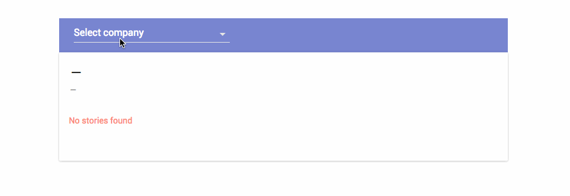

## MergeMarket dev test

Made with Express, React and Redux with Babel and Webpack.

### How to start the project

This project uses [config](https://www.npmjs.com/package/config) to store default config variables and get them from the
environment. Since the Mongo URL needs credentials, ad credentials are never to be stored in Git, they need to be
provided via an environment variable.

#### Dev mode 

To run the project locally in development mode on port 8888, after `npm i`, invoke:

`MM_MONGO_URL='mongodb://<user>:<password>@ds037551.mongolab.com:37551/mm-recruitment' npm run dev`

with the user and password provided in the homework file.

Development mode will provide hot reload, file watching and redbox error alerts.

#### Prod mode 

To run the project locally in production mode (uglified javascript, no Webpack plugins or helpers) on port 8888, invoke:

`MM_MONGO_URL='mongodb://<user>:<password>@ds037551.mongolab.com:37551/mm-recruitment' npm start`

with the user and password provided in the homework file.

### How to build

To build the UI project, just run

`npm run build`

The static file will be available in the `build/` directory

### How to run the tests

Component & unit tests are written using [tap](http://www.node-tap.org/) and [enzyme](http://airbnb.io/enzyme/).

To run them, just invoke

`npm t`

### How to lint

This project uses [standard javascript](http://standardjs.com/index.html) and [Eslint](http://eslint.org/). To run the
liner, invoke

`npm run lint`

### Notes

The server exports a reusable router, to serve the project on any endpoint. The server code is ES6. For this reason, the
`engine` specified in `package.json` advises to use node >= v6.3.1.
